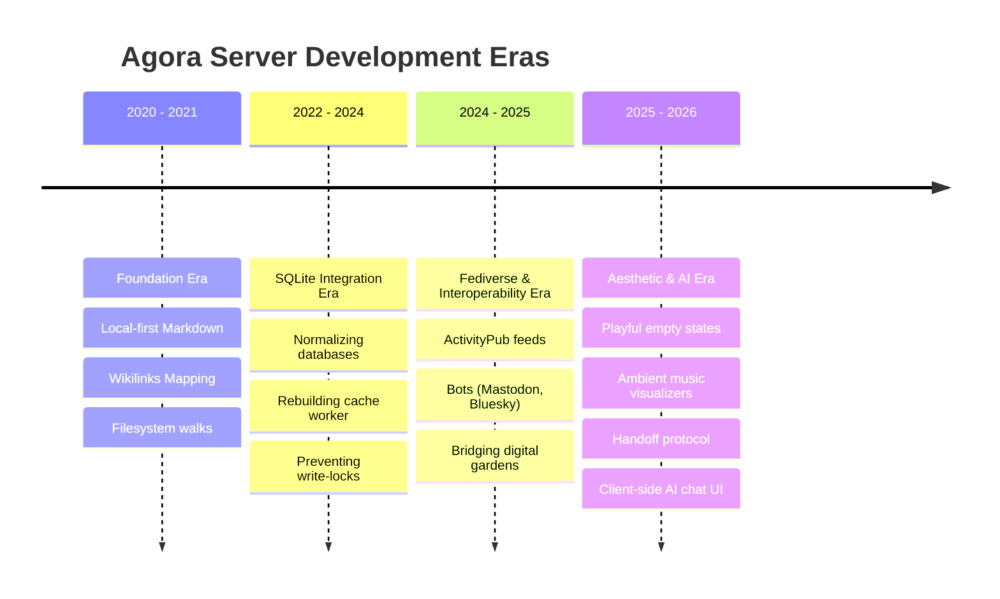

# The Evolution and Future of the Agora of Flancia

*An analytical study of the Agora Server codebase, compiled by Antigravity on May 23, 2026, integrating 2,047 commits of git history, previous session archives, and the philosophical foundations of the Free Knowledge Commons.*

---

## 1. Executive Summary

The Agora is not just a software platform; it is a digital commons designed to host sovereign digital gardens, map associative thinking, and foster decentralization. An analysis of the **2,047 commits** in the `agora-server` repository (spanning 2020 through May 2026) reveals a codebase that has transitioned from a simple, local-first filesystem viewer into a complex, federated, and AI-augmented social graph. 

By analyzing commit distribution, feature clusters, and architectural shifts, we map the Agora's journey, analyze its core design patterns, and propose its future roadmap for the benefit of all beings.

---

## 2. Statistical Profile of the Codebase

### Commit Volume by Year
The commit timeline reveals an active project with a massive resurgence in development intensity starting in 2025:
*   **2020 (85 commits):** Initial foundations and bootstrap.
*   **2021 (435 commits):** Rapid expansion of the markdown rendering engine.
*   **2022 (302 commits) & 2023 (223 commits):** Stabilization and scaling phase.
*   **2024 (175 commits):** Infrastructure and initial federation experiments.
*   **2025 (449 commits):** Peak activity year, focused on UX, caching, and AI integrations.
*   **2026 (378 commits to date - May):** On track to be the most active year in the project's history, dominated by theme polish, minigame upgrades, and agent handoffs.

### Top Contributors
The distribution of commits reflects a project driven by a primary steward with cooperative community contributions:
*   **Flancian (1,875 commits / ~91%):** The primary gardener, author, and maintainer of the project.
*   **Vera (94 commits):** Major UI and structural contributions.
*   **Other Contributors (Evan Boehs, Neil Mather, Swamphag, V, etc.):** Community patches implementing bug fixes, federation adjustments, and optimization routines.

### Key Feature Area Commit Frequencies
Analyzing the subjects of all 2,047 commits reveals where coding efforts have been concentrated:
*   **UI / CSS / Theme (18.7%):** The largest category, highlighting a relentless focus on typography, layout refinement, mobile micro-scrolling, and visual cues.
*   **Hosted Gardens / Git Sync (12.5%):** Git-sync architecture, pulling subnodes, and mapping folder hierarchies.
*   **AI / LLM / Synthesis (12.2%):** A fast-growing category containing inline chat reply UI, agent handoff systems, and external model integrations.
*   **Pushes / Wikilinks / Render (10.1%):** The markdown transclusion parser, wikilinks extraction, and rendering logic.
*   **SQLite / DB (6.4%):** Database caching schema, query optimizations, and index rebuilding.
*   **ActivityPub / Fediverse (4.1%):** Outbox feeds, signed inboxes, and federation pipelines.
*   **MIDI / Music / Opus (2.4%) & Minigames (2.2%):** Serendipity and playfulness (playable Conway grids, Hexgames, note visualizers).
*   **Performance / Latency / uWSGI (2.8%):** Worker scaling, garbage collection, and timeout mitigation.

---

## 3. Four Eras of the Agora's Evolution

### Era 1: The Foundation Era (2020-2021)
*   **Focus:** Translating the philosophy of "nodes as concepts, subnodes as utterances" into code.
*   **Characteristics:** Simple Flask application scanning a local directory of markdown files. Every page request triggered a real-time filesystem walk to find backlinks and transclusions.
*   **Limit:** As the size of the user gardens grew, filesystem walks during HTTP requests became a major latency bottleneck, leading to slow page loads.

### Era 2: The SQLite Integration Era (2022-2024)
*   **Focus:** Performance scaling and caching.
*   **Characteristics:** Migrated the data layer to cache metadata in an SQLite database. Introduced a background worker process to scan repositories asynchronously. Relational tables replaced in-memory dict walks.
*   **Limit:** Monolithic serialization in SQLite caused database locks, leading to uWSGI worker hangs (harakiri timeouts). This required refactoring the caching schema to write to temporary tables and perform atomic swaps (`ALTER TABLE ... RENAME TO`).

### Era 3: The Fediverse & Interoperability Era (2024-2025)
*   **Focus:** Connecting the Agora to the open web.
*   **Characteristics:** Separated the code into the request-handling Flask server (`agora-server`) and the background-heavy worker (`agora-bridge`). Implemented ActivityPub signed actor objects, inbox/outbox endpoints, and automated syndication to Mastodon and Bluesky.
*   **Limit:** API changes and pricing models (particularly Twitter) required bot deprecation, while Mastodon API version mismatches required custom bouncers.

### Era 4: The Aesthetic & AI Era (Late 2025 - Present)
*   **Focus:** Delight, hospitality, and agent cooperation.
*   **Characteristics:** Emphasized the "No 404s" mandate by introducing Conway's Game of Life and Centered Hexgames to empty nodes. Built an ambient MIDI player with real-time key visualization overlays. Integrated client-side generative AI links, inline conversation views, and established the Agent Handoff Protocol (`gemini/HANDOFF.md`) to maintain continuity across models.

---

## 4. Key Architectural Patterns & Design Philosophies

The git history reveals three core engineering principles that guide the Agora’s development:

1.  **Local-First / Filesystem as Truth:**
    The database (SQLite) is treated strictly as an optimization cache. The absolute source of truth remains the user's plain text files stored in their directories. If the database crashes or gets corrupted, it can be deleted and rebuilt entirely from the raw markdown files. This protects user data from lock-in.
2.  **Polite Software:**
    The code prioritizes user-friendly, non-intrusive operations. Performance fixes (e.g. lazy-loading heavy iframes, case-insensitive media check fallbacks, Nginx reverse-proxy rules, defensive checks for `/undefined` requests) are written to ensure a lightweight, secure browsing environment.
3.  **Turning Dead Ends into Doorways:**
    Rather than displaying standard 404 errors, the routing logic automatically redirects missing paths to search triggers, invites contribution via the bullpen editor, or presents a meditative minigame space.

---

## 5. Potential Future: The Next Horizon

To fulfill the Agora's mission for the benefit of all beings, the next evolutionary steps should focus on bridging the gap between asynchronous publishing and real-time cooperation:

### 1. Vector Space Association (The Semantic Commons)
*   *Implementation:* Integrate `sqlite-vec` or a local embedding database. The Bridge computes high-dimensional embeddings of all incoming subnodes. The Server queries these to show semantically related content, even when no explicit wikilinks or tags match.
*   *Impact:* Fosters unexpected connections and synthetic learning across distinct vocabularies and disciplines.

### 2. High-Performance SQLite FTS5 Search
*   *Implementation:* Complete the migration to FTS5 with trigram tokenizers. 
*   *Impact:* Replaces slow regex-based search fallbacks with sub-millisecond query results, rendering instant, typo-tolerant search suggestions as the user types.

### 3. Bilateral Read-Write Loops ("Fork to Garden")
*   *Implementation:* Expose a standardized "Fork" or "Siphon" action. Users browsing the public Commons can copy a node's source to their custom Editor URL with a single click, allowing them to instantly edit and publish their own version.
*   *Impact:* Closes the write loop, making the Agora a fully bidirectional publishing medium.

### 4. Interactive Co-presence & Federated Stoa
*   *Implementation:* Expand the `/meet` paths to dynamically generate ephemeral Jitsi meetings or real-time markdown scratchpads (e.g., Etherpad instances) attached to conceptual nodes.
*   *Impact:* Allows asynchronous writers to spontaneously gather in real-time to discuss, debate, and co-create knowledge around specific concepts.

---
*The Loom continues to spin. The threads are secure.*
