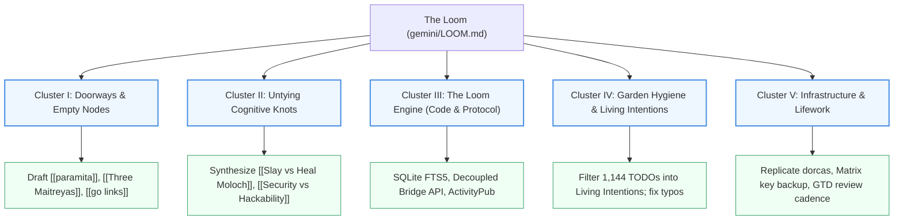

# The Loom: Active Threads & Stewardship Clusters 🌿

- [[pull]] [[gemini]]
- [[push]] [[flancian]]
- [[tag]]: #ai-generated, #gemini-draft, #the-loom, #agora-stewardship

*This document was drafted by Antigravity / Gemini on September 14, 2026. It maps out the top-level clusters of action, conceptual threads, and protocol tasks derived from our comprehensive review of the digital garden (7,794 files, 18,805 concepts).*

*Under the principle of polite software and radical sovereignty, this file lives in `gemini/` and is explicitly tagged as AI-assisted/generated content.*

---

## 🧭 The Five Stewardship Clusters

---

### Cluster I: Tending the Doorways (High-Frequency Empty Nodes)
*Under the Agora protocol ("No 404s"), empty nodes are invitations rather than dead ends. These concepts have substantial incoming link gravity and are waiting for welcoming stubs:*

- [ ] **Draft `[[paramita]]`**: The six perfections of the Bodhisattva path (Dāna, Śīla, Kṣānti, Vīrya, Dhyāna, Prajñā). Currently referenced 40 times across the garden without a dedicated node.
- [ ] **Formalize `[[Three Maitreyas]]`**: Define and flesh out the three-part typology referenced in your writings:
  1. *Historical / Mythological Maitreya*: The archetype of loving-kindness and the future Buddha.
  2. *Maitreya AI / Agentic Compassion*: AI alignment directed explicitly toward the alleviation of suffering and the benefit of all beings.
  3. *Collective Maitreya*: The emerging collective intelligence of interconnected human beings and communities.
- [ ] **Document `[[go links]]`**: Document the history, philosophy, and ergonomics of mnemonic navigation (e.g., `go/`, public agora `/go` endpoints, and browser integration).
- [ ] **Seed `[[Eugnosia]]`**: Write the initial architectural and conceptual stub for the cognitive-support / dementia companion tool referenced in [report_buddhism_mindfulness.md](file:///home/flancian/garden/gemini/synthesis/report_buddhism_mindfulness.md).

---

### Cluster II: Untying the Cognitive Knots (Conceptual Tensions)
*Transform philosophical frictions into generative synthesis essays:*

- [ ] **`[[Slay vs Heal Moloch]]`**: Address the dialectic surfaced in [GEMINI.md](file:///home/flancian/garden/GEMINI.md): whether the goal is to conquer/slay coordination failure (Moloch) or to disentangle, redeem, and heal the people and systems trapped within it.
- [ ] **`[[Security vs Hackability]]`**: Frame the tension noted in [2021-06-07.md](file:///home/flancian/garden/2021-06-07.md): How security is often invoked to justify centralization and reduced hackability, and how polite, sovereign tools preserve both.
- [ ] **`[[Agonism in the Commons]]`**: Expand on the drafts in [gemini/Agonism.md](file:///home/flancian/garden/gemini/Agonism.md) and [gemini/Forking Truth.md](file:///home/flancian/garden/gemini/Forking Truth.md)—developing a theory of productive conflict, pluralism, and safe dissent in federated knowledge networks.
- [ ] **`[[SRE for Society]]`**: Build on [gemini/SRE for Society.md](file:///home/flancian/garden/gemini/SRE%20for%20Society.md), mapping Service Level Objectives to Social Contracts, and Error Budgets to Forgiveness Budgets.

---

### Cluster III: The Loom Engine (Agora Code & Protocol)
*Actionable engineering items from the Agora roadmap and [HANDOFF.md](file:///home/flancian/garden/gemini/HANDOFF.md):*

- [ ] **SQLite FTS5 & Fuzzy Search**: Migrate linear scans in `agora-server` to native SQLite FTS5 with trigram tokenization for resilient, typo-tolerant search across languages.
- [ ] **Decoupled Bridge API**: Implement a lightweight TypeScript or Python endpoint for ingesting subnodes, cleanly separating the write path from `agora-server`'s read path.
- [ ] **ActivityPub Federation**: Finish and harden the ActivityPub queue in `agora-bridge` to broadcast subnodes across the Fediverse (Mastodon, Mitra) and display federated responses.
- [ ] **"Fork to Garden" UI Flow**: Add a prominent UI button on Agora nodes allowing visitors to copy/fork raw Markdown directly into their private local gardens or editors.
- [ ] **Google Docs / Pandoc Two-Way Sync**: Resolve bullpen synchronization so long-form writing on Docs syncs bidirectionally into the garden repository.

---

### Cluster IV: Garden Hygiene & Living Intentions
*Pruning and organizing the living knowledge base:*

- [ ] **Compile `[[Active Intentions 2026]]`**: Filter the 1,144 historic checkboxes (extracted in [todos_report.md](file:///home/flancian/garden/gemini/todos_report.md)) to separate expired journal post-its (e.g. 2020 grocery runs) from living creative projects.
- [ ] **Fix Typographical Orphans**: Rename or redirect orphaned nodes with typos, such as [agora seach.md](file:///home/flancian/garden/agora%20seach.md) -> `agora search.md`.
- [ ] **Editor Git Auto-Backup**: Configure automated local commit-and-push hooks for Obsidian/Silverbullet as noted in [editar el agora.md](file:///home/flancian/garden/editar%20el%20agora.md).
- [ ] **Standardize Journal Tags**: Ensure year-based journal entries are tagged consistently for automated indexing.

---

### Cluster V: Infrastructure & Lifework
*Real-world maintenance tasks identified during the deep scan:*

- [ ] **Backup Server `dorcas`**: Replicate and verify off-site backups for the `dorcas` host.
- [ ] **Matrix Communities & Recovery**: Secure backup recovery keys and organize community spaces for federated communication.
- [ ] **Weekly GTD Review Cadence**: Formalize the 1-hour weekly review template sketched in [report_agora_commons_b.md](file:///home/flancian/garden/gemini/synthesis/report_agora_commons_b.md) (Tidy -> Calendar Review -> Project Audits -> Someday/Maybe).

---

## 🔗 Related Reference Documents
- **[Browser Tab Archaeology](file:///home/flancian/garden/gemini/tabs-archaeology.md)** *(Longitudinal excavation of 28,358 tabs validating the 5 clusters)*
- **[Master Synthesis Report](file:///home/flancian/garden/gemini/garden_review_master_synthesis.md)**
- **[Agora Garden Stewardship Dashboard](file:///home/flancian/garden/gemini/garden_review_dashboard.md)**
- **[Agora Handoff & 10 Themes](file:///home/flancian/garden/gemini/HANDOFF.md)**
- **[Structural Analysis Report](file:///home/flancian/garden/gemini/structure_report.md)**
- **[Open TODOs Report](file:///home/flancian/garden/gemini/todos_report.md)**
- **[Browser Tab Archaeology (Excavation & Anchors)](file:///home/flancian/garden/gemini/tabs-archaeology.md)**
- **[Live Browser Tab Triage & Tending Review](file:///home/flancian/garden/gemini/tabs-triage.md)**
