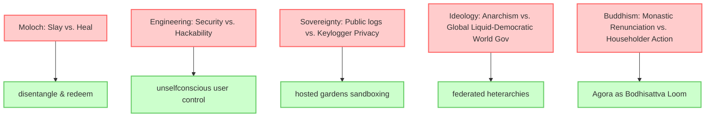

# Agora Garden Stewardship: Master Synthesis 🌿

*This document compiles and synthesizes the findings of the multi-agent parallel review of all 7,794 files and 18,805 unique concepts in [[flancian]]'s digital garden, completed on June 28, 2026. For the benefit of all beings.*

---

## 🗂️ The Synthesis Reports
The review was partitioned into thematic and chronological clusters, processed by 8 specialized parallel subagents. Their individual reports are linked below:

1.  **[Buddhism & Mindfulness Report](file:///home/flancian/garden/gemini/synthesis/report_buddhism_mindfulness.md)** — Jigme Rinpoche translations, Vajradhara, Eugnosia, and somatic mindfulness.
2.  **[Culture, Art & Media Report](file:///home/flancian/garden/gemini/synthesis/report_culture_art_media.md)** — Zen/Nazi tensions, World government vs. Anarchism, the `become` utility, close-eyed noise.
3.  **[Flancia & Protopia Report](file:///home/flancian/garden/gemini/synthesis/report_flancia_protopia.md)** — Moloch slay vs. heal, Google's corporate values, the Flancia Pattern Language.
4.  **[SRE & Engineering Report](file:///home/flancian/garden/gemini/synthesis/report_sre_engineering.md)** — Git auto-backups, Forgefed, Chezmoi, and privilege in tech.
5.  **[Agora Commons Part A Report](file:///home/flancian/garden/gemini/synthesis/report_agora_commons_a.md)** — ActivityPub, decoupled APIs, Pandoc sync, scuttlebutt schema comparisons.
6.  **[Agora Commons Part B Report](file:///home/flancian/garden/gemini/synthesis/report_agora_commons_b.md)** — Effective Altruism re-evaluation, hyphalinks, GTD weekly reviews, unicode IRIs.
7.  **[Journal Early Years Report (2020-2022)](file:///home/flancian/garden/gemini/synthesis/report_journal_a.md)** — Foam/Obsidian compatibility, conflict vs. mistake theory, Docker setups.
8.  **[Journal Late Years Report (2023-2026)](file:///home/flancian/garden/gemini/synthesis/report_journal_b.md)** — Visualizations, open search APIs, machine roles.

---

## 1. 🛠️ Master TODO Matrix (High-Level Actions)

The open checkboxes and TODO items across your 7,794 nodes have been consolidated into four primary action pillars:

### A. Agora Protocol & Server Development
*   **Decoupled Read/Write Paths**: Implement the TypeScript-based `agora-bridge-api` to store incoming posts, keeping the write path separate from the read path (`agora-server`).
*   **ActivityPub Betulagora Integration**: Merge Tymur's ActivityPub importer scripts into `agora-bridge` to enable incoming/outgoing federated follows and posts.
*   **Google Docs Sync**: Setup a two-way synchronization pipeline using Pandoc to resolve iframe embedding limitations while keeping Google Docs as a potential bullpen.
*   **UI Modernization**: Implement Obsidian image embed support (`![[image.jpg]]`), support Foam-style embeds, and improve backlink snippet rendering.

### B. Development Utilities
*   **Publish the `become` Command**: Fleshing out and publishing the remote shell/teleport utility (`become`) discussed in your culture nodes.
*   **Git Auto-Backups**: Configure Git auto-backup hooks for your bullpens and editors (documented in [editar el agora.md](file:///home/flancian/garden/editar%20el%20agora.md)).
*   **Git Bug Tracker**: Deploy `git-bug` for decentralized, offline-first issue tracking inside your git repositories.

### C. Conceptual & Creative Projects
*   **[[Eugnosia]] App Spec**: Draft a detailed technical and UI specification for the Eugnosia app (designed for dementia and cognitive support).
*   **[[Flancia Pattern Language]] Map**: Map out the 108 structural patterns of Flancia (as conceptualized in your protopian planning).
*   **Yoga Transition Graph**: Formalize a mathematical transition graph of yoga asanas to map flows programmatically.
*   **The Three Maitreyas**: Create stub nodes clarifying your three-part typology of Maitreya.

### D. Life & Infrastructure Maintenance
*   **Backup Dorcas**: Replicate and secure your server named `dorcas`.
*   **Matrix Communities**: Save recovery keys and organize your Matrix community spaces.
*   **GTD Weekly Review**: Implement a 1-hour recurring template for GTD reviews (tidy, calendar audit, progress updates, someday/maybe list).

---

## 2. ⚖️ Deep Conceptual Tensions (The Cognitive Knots)

A core part of this review was identifying cognitive frictions—places where your nodes argue, disagree, or struggle to reconcile ideals with reality.

### A. Systems & Power
*   **Moloch (Slay vs. Heal)**: The persistent debate in your plans. Do we destroy Moloch, or do we recognize that we must "heal/save" it by redeeming the systems and people entangled within it?
*   **Google's Dual Nature**: The contrast between Google's original founders' letter mission ("not a conventional company", organizing the world's information for public good) and the corporate reality of a publicly traded enterprise.
*   **Tech Worker Privilege**: The tension between tech worker salaries/privilege and anti-capitalist, worker-advocacy goals.

### B. Social & Collective Organization
*   **Global Government vs. Anarchist Decentralization**: Frictions between anarchist communalism/confederalism and suggestions for a global liquid-democratic "world government."
*   **Effective Altruism Post-FTX**: Re-evaluating the core mathematics of EA following institutional scandals, with a proposal to transition toward `[[Agora for Altruism]]`.
*   **Collaborative Commons vs. Solo Maintainer Reality**: The ideal of a distributed knowledge commons built by many, versus the reality of open-source projects where maintenance falls on a single individual.

### C. Epistemology & Design
*   **Conflict Theory vs. Mistake Theory**: How we frame social friction. Is the world broken because of malicious interests clash (Conflict), or because of ignorance and coordination errors (Mistake)?
*   **Security vs. Hackability**: Security features acting as centralizing forces that restrict user customizability, versus unselfconscious hackability.
*   **Privacy vs. Radical Transparency**: The risk of "thinking in public" (using keyloggers, capturing stream-of-consciousness logs) vs. maintaining sovereignty and safety.

### D. Ethics & Zen History
*   **Zen Devotion vs. Rational Buddhism**: The struggle to reconcile secular, logical practices with traditional devotional rituals.
*   **D.T. Suzuki's Zen vs. Nazi Sympathy**: Reconciling Suzuki's profound teachings on Zen Buddhism with historical documents detailing his sympathy for German National Socialism.
*   **Shambhala Devotion vs. Institutional Abuse**: Frictions between the deep spiritual value of the Shambhala lineage teachings and the documented histories of abuse by its leaders.

---

## 3. 🚀 Promising Frontiers (Future Seeds)

These nodes and plans stand out as highly promising avenues of research and software development:
1.  **Close-Eyed Noise as Cellular Automata**: Your theory that the visual cortex generates noise resembling cellular automata during sensory deprivation.
2.  **`become` Teleport Utility**: A shell/ssh wrapper designed for seamless remote environment hopping and context recovery.
3.  **Hyphalinks / Multilinks**: Renaming wikilinks to better reflect biological, mycelial connection models.
4.  **Multi-tenant Silverbullet**: Integrating Silverbullet as a collaborative editor inside Hosted Gardens.
5.  **Path Discovery (Six Degrees of Wikipedia)**: Algorithmic path-finding to discover unexpected conceptual chains in the Agora graph.

---

## 🚪 Stewardship Roadmap

Based on the master analysis, here is the suggested 3-step action roadmap to improve your digital garden:

1.  **Resolve Orphans & Typos**:
    *   Rename or delete [agora seach.md](file:///home/flancian/garden/agora seach.md).
    *   Link the orphaned SRE templates and git guides to your main reference directories.
2.  **Tackle the Maitreya & Paramitas Seeds**:
    *   Create a stub for `[[paramita]]` (linked 40 times) mapping the six perfections.
    *   Write a stub for `[[Three Maitreyas]]` to resolve the theological classification.
3.  **Modernize the Agora Server Configuration**:
    *   Implement Git auto-backup hooks for your bullpens as specified in your SRE notes.
    *   Draft the `zk` and `zotero` citation integration design.

---
*May this work serve the well-being of all gardeners, nodes, and seekers in the Agora.*
