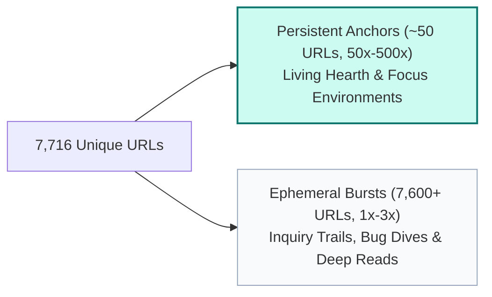

# Browser Tab Archaeology: Excavation, Anchors & Loom Cross-Pollination 🌿

- [[pull]] [[gemini]]
- [[push]] [[flancian]]
- [[tag]]: #ai-generated, #gemini-draft, #browser-archaeology, #the-loom, #agora-stewardship
- [[date]]: 2026-09-22

*This node synthesizes the longitudinal excavation of **28,358 tab instances** and **7,716 globally unique endpoints** across four computing eras (`nox`, `nostromo`, `paramita`, and `tara`). It directly cross-pollinates these empirical browser anchors with the Five Stewardship Clusters defined in [[LOOM.md]] and the Window 98 Garden Review (conversation ID: `743238fe-2c29-4340-9d89-6f9caa1b6351`).*

---

## 🧭 The 1:4 Dynamic: Anchors vs. Ephemeral Bursts

The global excavation revealed a sharp 1:3.67 ratio of distinct URLs to total tab checkpoints. This distribution mirrors the structure of human memory and intention:

1. **Persistent Anchors (High Duplication, 50x–500x)**: A core constellation of ~50 web environments kept open continuously across weeks, months, reboots, and machine migrations (`social.coop`, Gmail, Claude/Gemini, YouTube Music, Agora Editor).
2. **Ephemeral Bursts (Single Instance, 1x–3x)**: Thousands of exploratory inquiries opened during concentrated bursts of research (specific Wikipedia entries, GitHub bug discussions, Swiss transport logistics) that served an immediate purpose and subsided.

---

## 🌿 Cross-Pollination with the Five Loom Clusters

The browser excavation provides empirical, lived evidence for the five stewardship clusters articulated in [[LOOM.md]]:

### 1. Cluster I: Tending the Doorways ↔ Excavated Agora Queries
*In [[LOOM.md]], Cluster I calls us to turn high-frequency empty nodes into welcoming doorways (`[[paramita]]`, `[[Three Maitreyas]]`, `[[go links]]`, `[[Eugnosia]]`).*

* **The Living Evidence**: Over **1,087 unique Agora URLs** were found across browser tabs. Many were persistently open queries left unresolved in the browser:
  - `https://anagora.org/justine+tunney` (88x) — Exploration of Cosmopolitan libc, Actually Portable Executables, and radical computing sovereignty.
  - `https://anagora.org/?q=lama+jigme+rinpoche` (69x) — Inquiries into Bodhisattva vows and Buddhist lineage teachings.
  - `https://anagora.org/summer+night`, `https://anagora.org/heart-sutra-translation`, `https://anagora.org/eudaimonia` — Inward-looking nodes awaiting deeper personal synthesis.
* **The `[[go links]]` Anchor**: Multiple tabs anchored on mnemonic navigation (`https://anagora.org/go/yoga%20with%20x` [80x], `go/meet/...`). This demonstrates that mnemonic shortcuts are not merely an engineering convenience, but an ergonomic extension of working memory.
* **Cross-Pollination Action**:
  - Convert the top 10 most visited unresolved Agora tab queries into welcoming seed nodes in `~/garden`.
  - Document the philosophy of `[[go links]]` using the empirical tab patterns as direct use cases.

---

### 2. Cluster II: Untying Cognitive Knots ↔ Lived Dialectics
*In [[LOOM.md]], Cluster II addresses ideological frictions: `[[Slay vs Heal Moloch]]`, `[[Security vs Hackability]]`, and `[[Agonism in the Commons]]`.*

* **The Living Evidence**:
  - `https://news.ycombinator.com` was an unbroken anchor across all four machines (**167x** across Nox, Nostromo, Paramita, and Tara), alongside `theguardian.com` and `Página|12`.
  - Long-lived tabs in `social.coop` and Loomio governance discussions (e.g. `when-should-we-have-the-next-tech-group-meeting-`) alongside organizational culture essays like [What Makes a "Humming Team"?](https://www.thehum.org/post/what-makes-a-humming-team).
* **Synthesis**: The browser history shows that the dialectic between *slaying* and *healing* Moloch was lived daily in the balance between participating in open cooperatives (`social.coop`), tracking mainstream tech power dynamics on Hacker News, and protecting spaces of radical hospitality.

---

### 3. Cluster III: The Loom Engine ↔ Working Developer Environments
*In [[LOOM.md]], Cluster III focuses on code and protocol: SQLite FTS5, Decoupled Bridge API, ActivityPub federation, and two-way sync.*

* **The Living Evidence**:
  - `https://edit.anagora.org` (76x permanent anchor) — The live front-end of the Agora editor.
  - `https://github.com/silverbulletmd/silverbullet/issues` (76x permanent anchor) — Extensive study of SilverBullet for local-first, extensible markdown knowledge bases.
  - `https://app.element.io/#/room/#coopcloud-tech:autonomic.zone` — Co-op Cloud technical channels for deploying federated infrastructure.
  - Matrix, Mastodon API, and ActivityPub developer tabs.
* **Cross-Pollination Action**:
  - The tabs show that SilverBullet's local-first architecture and SQLite full-text search directly informed the vision for the Agora's decoupled bridge.
  - We can harvest the specific SilverBullet issue threads that were open to refine the "Fork to Garden" UI flow.

---

### 4. Cluster IV: Garden Hygiene ↔ The Power Law of Attention
*In [[LOOM.md]], Cluster IV focuses on distilling 1,144 historic checkboxes in [[todos_report.md]] into [[Active Intentions 2026]].*

* **The Living Evidence**:
  - Just as the 28,358 tabs condensed into a small set of true anchors and a wide field of ephemeral lookups, the 1,144 checkboxes in the garden split into identical categories: temporal groceries vs. eternal creative commitments.
  - Journal day editing tabs on Agora (`https://edit.anagora.org/Journal/Day/...`) consistently revisited specific recurring intentions.
* **Cross-Pollination Action**:
  - Apply the **Anchor vs. Burst filter** to the garden TODOs: items that match the persistent tab themes (Agora development, cooperative governance, Dharma, sound design) are true *Living Intentions*; one-off logistical tasks can be peacefully archived.

---

### 5. Cluster V: Infrastructure & Lifework ↔ Embodied Life
*In [[LOOM.md]], Cluster V handles backups (`dorcas`), Matrix key recovery, and weekly GTD reviews.*

* **The Living Evidence**:
  - **Sensory Scaffolding**: 130 ambient soundscape generators ([MyNoise](https://mynoise.net), [SomaFM DEF CON Radio](https://somafm.com), [NTS Live Slow Focus](https://www.nts.live)) and YouTube Music (68x) provided the sonic atmosphere for sustained deep work.
  - **Embodied Grounding**: Hundreds of tabs on Swiss domestic living (`galaxus.ch` [204], `digitec.ch` [95], `sbb.ch`, `ikea.com`), medical lookups, and travel (`booking.com` [161]).
* **Synthesis**: Radical sovereignty requires both technical backups (our `teras` SSD rescue and `backup-all`) and somatic care. The soundscapes and daily life logistics are the soil that sustains the intellectual work of the Agora.

---

## 🏛️ Top 25 Permanent Multi-Year Anchors

These 25 endpoints appeared with the greatest density across time and physical hardware:

| Count | Machines | Page Title & Canonical Link |
| :---: | :--- | :--- |
| **494x** | `nostromo, paramita, tara` | [social.coop/home](https://social.coop/home) |
| **342x** | `nostromo, paramita, tara` | [social.coop/notifications](https://social.coop/notifications) |
| **327x** | `nostromo, paramita, tara` | [mail.google.com (perseguidor)](https://mail.google.com/mail/u/0/#inbox) |
| **243x** | `paramita, tara` | [gemini.google.com/app](https://gemini.google.com/app) |
| **242x** | `nostromo, paramita, tara` | [claude.ai/new](https://claude.ai/new) |
| **167x** | `nox, nostromo, paramita, tara` | [news.ycombinator.com](https://news.ycombinator.com) |
| **161x** | `paramita, tara` | [Google Doc: 1RpO8zn2DbG6...](https://docs.google.com/document/d/1RpO8zn2DbG6_pUiLmtk6aoJawZV3UA_cz8Z57jMEubg/edit) |
| **134x** | `nox, nostromo, paramita, tara` | [mail.google.com (0@flancia.org)](https://mail.google.com/mail/u/1/#inbox) |
| **133x** | `paramita, tara` | [Google Doc: 1hiGSDXNB...](https://docs.google.com/document/d/1hiGSDXNBGXWQ1oBQnz9fdmO7j-l0ghiB1BA6P5kwg20/edit) |
| **106x** | `paramita, tara` | [Google Doc: 1DXJRDh9...](https://docs.google.com/document/d/1DXJRDh9Ss5VCRBi3oirDw9d7yjn3H2hMqfN2ETTyjIc/edit) |
| **88x** | `paramita, tara` | [Personal Knowledge Graphs (Amazon)](https://www.amazon.de/dp/B0C3W3XG6S) |
| **88x** | `paramita, tara` | [anagora.org/justine+tunney](https://anagora.org/justine+tunney) |
| **84x** | `paramita, tara` | [x.com/theunfoldingway](https://x.com/theunfoldingway) |
| **76x** | `nostromo, paramita, tara` | [edit.anagora.org](https://edit.anagora.org) |
| **76x** | `paramita, tara` | [github.com/silverbulletmd/silverbullet/issues](https://github.com/silverbulletmd/silverbullet/issues) |
| **76x** | `paramita, tara` | [panda.anagora.org/dirigent](https://panda.anagora.org/dirigent) |
| **73x** | `nostromo, paramita, tara` | [anagora.org](https://anagora.org) |
| **70x** | `paramita, tara` | [overleaf.com/project/...](https://www.overleaf.com/project/6692a0fa2199476302a29b42) |
| **69x** | `paramita, tara` | [anagora.org/?q=lama+jigme+rinpoche](https://anagora.org/?q=lama+jigme+rinpoche) |
| **68x** | `nox, nostromo, paramita, tara` | [music.youtube.com](https://music.youtube.com) |
| **65x** | `paramita, tara` | [x.com/manunamz](https://x.com/manunamz) |
| **59x** | `paramita, tara` | [social.agor.ai](https://social.agor.ai) |
| **58x** | `nostromo, paramita, tara` | [youtube.com](https://www.youtube.com) |
| **56x** | `nox, nostromo, paramita, tara` | [social.coop/@flancian](https://social.coop/@flancian) |
| **54x** | `nostromo, paramita, tara` | [app.element.io](https://app.element.io) |

---

## 🪷 Curated Thematic Nodes

### 1. [[Philosophy & Contemplative Practice]] (48 Unique Endpoints)
- **Lineage & Dharma**:
  - [Lama Jigme Rinpoche Teachings & Center](https://anagora.org/?q=lama+jigme+rinpoche)
  - [Thich Nhat Hanh Teachings](https://anagora.org/thich%20nhat%20nan)
  - [Heart Sutra Translation & Commentary](https://anagora.org/heart-sutra-translation)
- **Embodied Practice**:
  - [Yoga With Adriene Calendar](https://yogawithadriene.com/calendar/)
  - [Yoga with X (Agora Mnemonic)](https://anagora.org/go/yoga%20with%20x)
- **Philosophical Inquiry**:
  - [Eudaimonia (YouTube / Lectures)](https://www.youtube.com/results?search_query=eudaimonia)
  - [Ayn Rand Critique in the Commons](https://anagora.org/ayn-rand)
  - [Diaspora by Greg Egan (Science Fiction & Consciousness)](https://anagora.org/diaspora%20greg%20egan)

### 2. [[Ambient Soundscapes & Focus Audio]] (130 Unique Endpoints)
- **Generative Soundscapes ([MyNoise](https://mynoise.net))**:
  - [African Life — Interactive Urban Ambience](https://mynoise.net/NoiseMachines/senegalUrbanLifeAmbienceGenerator.php)
  - [Mexico City — Interactive Soundscape](https://mynoise.net/NoiseMachines/mexicoCityAmbienceGenerator.php)
  - [Primeval Forest — European Forest Ambience](https://mynoise.net/NoiseMachines/primevalEuropeanForestSoundscapeGenerator.php)
  - [Bonjour Paris — Urban Soundscape](https://mynoise.net/NoiseMachines/parisCityAmbienceGenerator.php)
- **Radio & Streaming Commons**:
  - [SomaFM DEF CON Radio (Hacker / Chill)](https://somafm.com/player/#/now-playing/defcon)
  - [NTS Live — Slow Focus Infinite Mixtape](https://www.nts.live/infinite-mixtapes/slow-focus)
  - [Radijo-Musikií](https://www.radijo-musikii.net/)

### 3. [[Artificial Intelligence & Frontier Models]] (275 Unique Endpoints)
- **Conversational Workbenches**:
  - [Claude.ai Workbench](https://claude.ai/new) (242x)
  - [Google Gemini App](https://gemini.google.com/app) (243x)
  - [Mistral 7B & Mistral AI](https://anagora.org/mistral%20ai)
  - [Hugging Face Hub & Models](https://huggingface.co/)
- **Synthesis**: The explosive rise from 0 AI tabs in the Nox era to 284 tabs on Paramita and Tara represents the emergence of agentic pair-programming as a primary instrument of thought.

---

## 🔗 Generated Formats & Artifacts
The complete, unabridged catalog of all 7,716 unique links is available in these local artifacts:
* **PDF Document**: [`/home/flancian/browser-tab-archaeology.pdf`](file:///home/flancian/browser-tab-archaeology.pdf) (vector typography, ready to read or share)
* **DOCX Document**: [`/home/flancian/browser-tab-archaeology.docx`](file:///home/flancian/browser-tab-archaeology.docx) (importable directly into Google Docs)
* **HTML Document**: [`/home/flancian/browser-tab-archaeology.html`](file:///home/flancian/browser-tab-archaeology.html)
* **CLI Engine**: [`/home/flancian/bin/mine-browsers`](file:///home/flancian/bin/mine-browsers) (real-time mining and search tool)

---
*For the benefit of all beings.*
