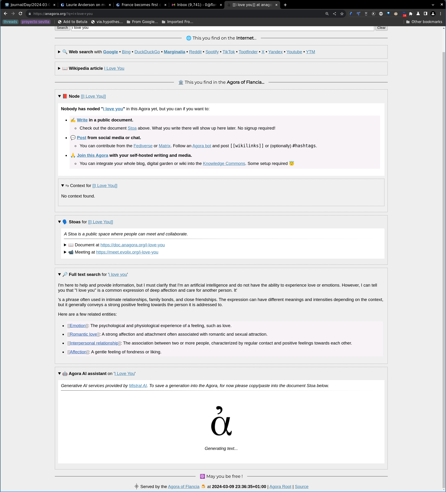

- The linked screenshot exemplifies a bug that’s been around since I added the AI Assistant to the [[Agora]] -- sometimes the output, once generated, is pasted into the wrong div :D
  - Should be fun to fix, hypothesis is that I reused class names a bit too much ;)