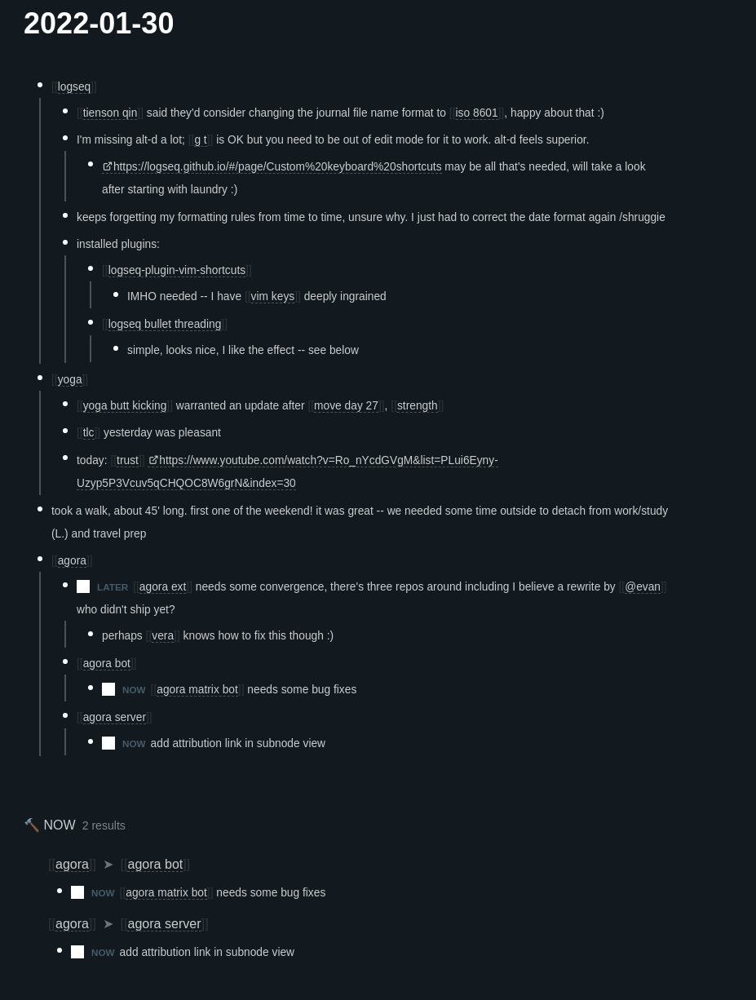

- [[logseq]]
	- [[tienson qin]] said they'd consider changing the journal file name format to [[iso 8601]], happy about that :)
	- I'm missing alt-d a lot; [[g t]] is OK but you need to be out of edit mode for it to work. alt-d feels superior.
		- https://logseq.github.io/#/page/Custom%20keyboard%20shortcuts may be all that's needed, will take a look after starting with laundry :)
	- keeps forgetting my formatting rules from time to time, unsure why. I just had to correct the date format again /shruggie
	- installed plugins:
		- [[logseq-plugin-vim-shortcuts]]
			- IMHO needed -- I have [[vim keys]] deeply ingrained
		- [[logseq bullet threading]]
			- simple, looks nice, I like the effect -- see below (If these attachments work in the Agora, need to check)
			- 
- [[yoga]]
	- [[yoga butt kicking]] warranted an update after [[move day 27]], [[strength]]
	- [[tlc]] yesterday was pleasant
	- today: [[trust]] https://www.youtube.com/watch?v=Ro_nYcdGVgM&list=PLui6Eyny-Uzyp5P3Vcuv5qCHQOC8W6grN&index=30
	- [[fwfg]]
- took a walk, about 45' long. first one of the weekend! it was great -- we needed some time outside to detach from work/study (L.) and travel prep
- [[agora]]
	- LATER [[agora ext]] needs some convergence, there's three repos around including I believe a rewrite by [[@evan]] who didn't ship yet?
		- perhaps [[vera]] knows how to fix this though :)
	- [[agora bot]]
		- DONE [[agora matrix bot]] needs some bug fixes
		  :LOGBOOK:
		  CLOCK: [2022-01-30 Sun 16:10:09]--[2022-03-02 Wed 12:59:27] =>  740:49:18
		  :END:
			- -> [[agora bot bugs]]
	- [[agora server]]
		- NOW add attribution link in subnode view
		  :LOGBOOK:
		  CLOCK: [2022-01-30 Sun 16:10:52]
		  :END:
	- [[empoderadas]]
	- #push [[extraterritorialidad]]
		- [[saer]]
		- DONE pomodoro
		  :LOGBOOK:
		  CLOCK: [2022-01-30 Sun 19:38:43]--[2022-03-02 Wed 12:59:19] =>  737:20:36
		  :END:
		- DONE pomodoro
		  :LOGBOOK:
		  CLOCK: [2022-03-02 Wed 12:59:17]--[2022-03-02 Wed 12:59:18] =>  00:00:01
		  :END:
	- [[agora discuss]] is just mindblowingly good