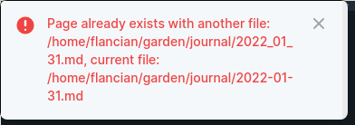

- Back from one week in [[argentina]]!
- [[logseq]]
	- Keeps somehow misplacing/ignoring my settings, in particular surrounding the date format for my journal filenames. Mildly irksome, in particular given that it generates spurious warning messages while at it:
		- 
	- DONE find bug report in [[go/logseq/bugs]] or file a new bug
	  :LOGBOOK:
	  CLOCK: [2022-03-02 Wed 12:59:05]--[2022-03-02 Wed 12:59:05] =>  00:00:00
	  :END:
		- I think https://github.com/logseq/logseq/issues/3861 is this.
- [[agora discuss]]
	- [[tarot for thought]]
	- [[maya kate]] [[agora open questions]]
	- [[neil]] [[resonate]]
- [[awesome wiki projects]]
- [[decentralized identifier]]
- have a backlog of things I should do now that we're back
	- DONE unpack
	  collapsed:: false
	  :LOGBOOK:
	  CLOCK: [2022-02-11 Fri 13:13:37]--[2022-02-11 Fri 18:05:10] =>  04:51:33
	  CLOCK: [2022-02-11 Fri 19:44:22]--[2022-02-20 Sun 14:57:45] =>  211:13:23
	  :END:
	- DONE laundry
	  collapsed:: false
	  :LOGBOOK:
	  CLOCK: [2022-02-11 Fri 13:13:16]--[2022-02-11 Fri 18:04:57] =>  04:51:41
	  CLOCK: [2022-02-11 Fri 18:05:04]--[2022-02-20 Sun 14:57:47] =>  212:52:43
	  :END:
	- DONE upload photos
	  collapsed:: false
	  :LOGBOOK:
	  CLOCK: [2022-02-11 Fri 19:44:18]--[2022-02-20 Sun 14:58:13] =>  211:13:55
	  :END:
	- DONE take a nap
	  collapsed:: false
	  :LOGBOOK:
	  CLOCK: [2022-02-11 Fri 13:13:26]--[2022-02-11 Fri 16:57:51] =>  03:44:25
	  :END:
	- DONE unigraph review
	  collapsed:: false
	  :LOGBOOK:
	  CLOCK: [2022-02-11 Fri 19:46:31]--[2022-02-11 Fri 19:46:36] =>  00:00:05
	  CLOCK: [2022-03-02 Wed 12:58:58]--[2022-03-02 Wed 12:58:59] =>  00:00:01
	  :END:
	- LATER [[autopush]]
		- [[autopush.sh]]
			- add photos sync to my hacky implementation, this could be cron central
		- add arbitrary triggers for [[push]] behaviour, NOW/LATER being obvious candidates
		- make #push work without [[wikilinks]] and make sure that it works with multiple nodes in arbitrary positions when you do use wikilinks
	- DONE [[fix attribution]]
	  :LOGBOOK:
	  CLOCK: [2022-02-11 Fri 19:59:07]--[2022-03-02 Wed 12:58:50] =>  448:59:43
	  :END:
	- LATER [[fix ranking]]
	- DONE catch up with friends!
	  collapsed:: false
	  :LOGBOOK:
	  CLOCK: [2022-02-11 Fri 19:46:27]--[2022-02-20 Sun 14:57:50] =>  211:11:23
	  :END:
	- DONE [[flancia]]
	  :LOGBOOK:
	  CLOCK: [2022-02-11 Fri 19:44:13]--[2022-02-20 Sun 14:58:09] =>  211:13:56
	  :END:
		- think about funding
			- which projects I need to fund this weekend
			- #push how to answer [[ultimape]]'s great question fully
				- https://pinafore.social/statuses/107755233690287648