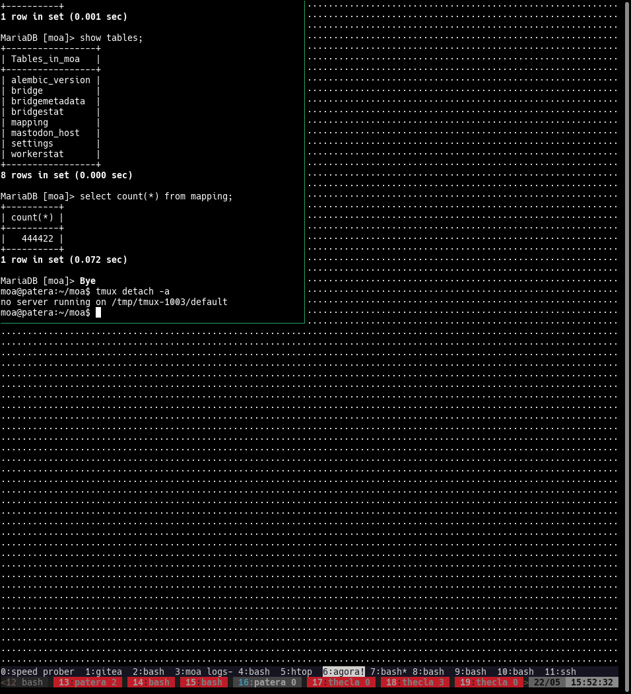

- [[push]] [[tmux]]
	- [[window]] `<c-b>:resize-window -A`
	- [[pane]] hold `<c-b>` and press arrows
	- [[tmux]] has this annoying habit to always fit to the *smallest* terminal attached to a session, even if inactive.
		- it results in terminals that look like this:
		- 
		- starting after version 2.8 (version 2.8 doesn't have this), you can use `resize-window` as per the above -- or just drop this in .tmux.conf to have it fit instead to the largest window:
			- `set -g window-size largest`
			- https://stackoverflow.com/questions/7814612/is-there-any-way-to-redraw-tmux-window-when-switching-smaller-monitor-to-bigger